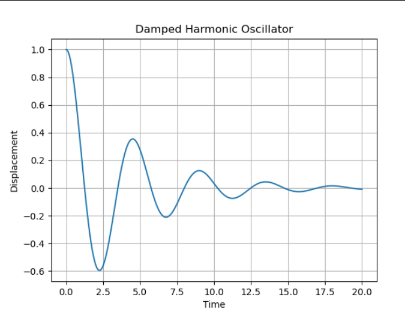

# Numerical Simulation of a Damped Harmonic Oscillator

## 📖 Overview
This project models the motion of a damped harmonic oscillator using numerical methods in Python.

The system is governed by a second-order differential equation derived from Newton’s laws. The equation is transformed into first-order equations and solved using the Euler method.

## ⚙️ Mathematical Model
The governing equation is:

m(d²x/dt²) + b(dx/dt) + kx = 0

Where:
- m = mass
- b = damping coefficient
- k = spring constant

## 🧪 Method
- Converted second-order ODE into first-order system
- Applied Euler numerical method
- Simulated motion over time

## 📊 Results
The simulation shows how damping causes oscillatory motion to decay over time.

## 📈 Output

## 🧠 Skills Demonstrated
- Mathematical modeling
- Differential equations
- Python programming
- Data visualization

## ▶️ How to Run
1. Install Python
2. Install required libraries:
   pip install numpy matplotlib
3. Run:
   python simulation.py

## 🎯 Author
Desire Igweze
